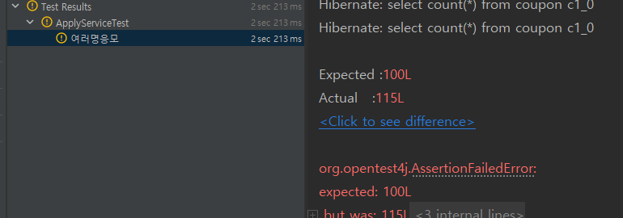

# 실습으로 배우는 선착순 이벤트 시스템

**인프런 최상용 님의 강의를 정리한 내용입니다.**


## 요구사항 정의

<aside>
👌🏼

선착순 100명에게 할인쿠폰을 제공하는 이벤트를 진행한다. 

이 이벤트는 아래와 같은 조건을 만족해야 한다.

- 선착순 100명에게만 지급
- 101개 이상이 지급되면 안된다.
- 순간적으로 물리는 트래픽을 버틸 수 있어야한다.
</aside>

## 프로젝트 기본 구조

coupon

```java

@Entity
@Getter
@NoArgsConstructor(access = AccessLevel.PROTECTED)
public class Coupon {

	@Id @GeneratedValue(strategy = GenerationType.IDENTITY)
	private Long id;

	private Long userId;

	public Coupon(Long userId) {
		this.userId = userId;
	}
}

```

ApplyService

```java
package com.example.couponsystem.service;

import org.springframework.stereotype.Service;

import com.example.couponsystem.domain.Coupon;
import com.example.couponsystem.repository.CouponRepository;

import lombok.RequiredArgsConstructor;

@Service
@RequiredArgsConstructor
public class ApplyService {

	private final CouponRepository couponRepository;

	public void apply(Long userId) {
		long count = couponRepository.count();
		if (count > 100) {
			throw new IllegalArgumentException("쿠폰은 최대 100개 까지만 발급할 수 있습니다.");
		}
		couponRepository.save(new Coupon(userId));
	}
}
```

Test Code 

```java
	@Test
	public void 여러명응모() throws InterruptedException {
		int threadCount = 1000;
		ExecutorService executorService = Executors.newFixedThreadPool(32);
		CountDownLatch latch = new CountDownLatch(threadCount);

		for (int i = 0 ; i < threadCount ; i++) {
			long userId = i;
			executorService.submit(() -> {
				try{
					applyService.apply(userId);
				} finally {
					latch.countDown();
				}
			});
		}
		latch.await();

		long count = couponRepository.count();

		assertThat(count).isEqualTo(100);
	}
```



Race Condition

쿠폰 100개보다 더 발급되는 동시성 이슈 발생 


### Redis를 활용한 동시성 이슈 해결

RedisRepository

```java
@Repository
@RequiredArgsConstructor
public class CouponCountRepository {

	private final RedisTemplate<String, String> redisTemplate;

	public Long increment() {
		return redisTemplate
			.opsForValue().
			increment("coupon_count");
	}
}

```

Service

```java
@Service
@RequiredArgsConstructor
public class ApplyService {

	private final CouponRepository couponRepository;

	private final CouponCountRepository couponCountRepository;

	public void apply(Long userId) {
		long count = couponCountRepository.increment();

		if (count > 100) {
			throw new IllegalArgumentException("쿠폰은 최대 100개 까지만 발급할 수 있습니다.");
		}
		couponRepository.save(new Coupon(userId));
	}
}
```

Test Code 

```java
	@Test
	public void 여러명응모() throws InterruptedException {
		int threadCount = 1000;
		ExecutorService executorService = Executors.newFixedThreadPool(32);
		CountDownLatch latch = new CountDownLatch(threadCount);

		for (int i = 0 ; i < threadCount ; i++) {
			long userId = i;
			executorService.submit(() -> {
				try{
					applyService.apply(userId);
				} finally {
					latch.countDown();
				}
			});
		}
		latch.await();

		long count = couponRepository.count();

		assertThat(count).isEqualTo(100);
	}
```


Redis는 싱글 쓰레드로 동작하기 때문에 언제나 최신값을 가져감으로 문제 해결 

발급하는 쿠폰의 개수가 많아질 수록 RDB에 부하를 준다. 

다른 서비스까지 장애가 발생할 수 있다. 


단기간에 많은 요청이 들어와 CPU의 사용량이 높아지고 서비스의 오류로 이어지는 문제가 있다. 

→ 카프카를 이용해 해결 

## 카프카를 이용한 개선

### Kafka란?

분산 이벤트 스트리밍 플랫폼 

이벤트 스트리밍이란 소스에서 목적지까지 이벤트를 실시간으로 스트리밍 하는 것 


기본 구조 

- Producer
- Topic
- Consumer

Topic : 큐라고 생각하면 된다. 

Producer : Topic에 데이터를 삽입할 수 있는 기능을 가진 것 

Consumer : Topic에 삽입된 데이터를 가져갈 수 있다. 

즉 Producer(소스)에서 Consumer(목적지)까지 데이터를 실시간으로 스트리밍 하도록 도와주는 플랫폼 

testTopic이란 이름을 가진 토픽 생성 

```java
docker exec -it kafka kafka-topics.sh --bootstrap-server localhost:9092 --create --topic testTopic
```

topic에 데이터를 보낼 수 있는 프로듀서 생성 

```java
docker exec -it kafka kafka-console-producer.sh --topic testTopic --broker-list 0.0.0.0:9092
```

testTopic에 삽입된 데이터를 가지고 올 수 있는 Consumer 생성 

```java
docker exec -it kafka kafka-console-consumer.sh --topic testTopic --bootstrap-server localhost:9092
```


이 Producer를 활용하여 쿠폰을 생성할 유저의 아이디를 topic에 넣고 consumer를 활용하여 유저의 아이디를 가져와 쿠폰을 생성 하도록 변경 

config

```java

@Configuration
public class KafkaProducerConfig {

	@Bean
	public ProducerFactory<String, Long> producerFactory() {
		HashMap<String, Object> config = new HashMap<>();

		config.put(ProducerConfig.BOOTSTRAP_SERVERS_CONFIG, "localhost:9092");
		config.put(ProducerConfig.KEY_SERIALIZER_CLASS_CONFIG, StringSerializer.class);
		config.put(ProducerConfig.VALUE_SERIALIZER_CLASS_CONFIG, LongSerializer.class);

		return new DefaultKafkaProducerFactory<>(config);
	}

	@Bean
	public KafkaTemplate<String, Long> kafkaTemplate() {
		return new KafkaTemplate<>(producerFactory());
	}
}
```

producer

```java
@Component
@RequiredArgsConstructor
public class CouponCreateProducer {

	private final KafkaTemplate<String, Long> kafkaTemplate;

	public void create(Long userId){
		kafkaTemplate.send("coupon_create", userId);
	}
}

```

service 

```java
@Service
@RequiredArgsConstructor
public class ApplyService {

	private final CouponRepository couponRepository;

	private final CouponCountRepository couponCountRepository;

	private final CouponCreateProducer couponCreateProducer;

	public void apply(Long userId) {
		long count = couponCountRepository.increment();

		if (count > 100) {
			throw new IllegalArgumentException("쿠폰은 최대 100개 까지만 발급할 수 있습니다.");
		}

		couponCreateProducer.create(userId);
	}
}
```

Consumer 실행 

```java
docker exec -it kafka kafka-console-consumer.sh --topic coupon_create --bootstrap-server localhost:9092 --key-deserializer "org.apache.kafka.common.serialization.StringDeserializer" --value-deserializer "org.apache.kafka.common.serialization.LongDeserializer"
```

Test Code 실행 시 


Java로 Consumer 작성 

KafkaConsumerConfig

```java
@Configuration
public class KafkaConsumerConfig {

	@Bean
	public ConsumerFactory<String, Long> consumerFactory() {
		Map<String, Object> config = new HashMap<>();

		config.put(ConsumerConfig.BOOTSTRAP_SERVERS_CONFIG, "localhost:9092");
		config.put(ConsumerConfig.GROUP_ID_CONFIG, "group_1");
		config.put(ConsumerConfig.KEY_DESERIALIZER_CLASS_CONFIG, StringDeserializer.class);
		config.put(ConsumerConfig.VALUE_DESERIALIZER_CLASS_CONFIG, LongDeserializer.class);

		return new DefaultKafkaConsumerFactory<>(config);
	}

	@Bean
	public ConcurrentKafkaListenerContainerFactory<String, Long> kafkaListenerContainerFactory() {
		ConcurrentKafkaListenerContainerFactory<String, Long> factory = new ConcurrentKafkaListenerContainerFactory<>();
		factory.setConsumerFactory(consumerFactory());

		return factory;
	}
}
```

CouponCreatedConsumer

```java
@Component
@RequiredArgsConstructor
public class CouponCreatedConsumer {

	private final CouponRepository couponRepository;

	@KafkaListener(topics = "coupon_create", groupId = "group_1")
	public void listener(Long userId) {
		System.out.println(userId);
	}
}

```

Test code 실행 시 


CouponCreatedConsumer에 쿠폰 발생 로직 추가 

```java
@Component
@RequiredArgsConstructor
public class CouponCreatedConsumer {

	private final CouponRepository couponRepository;

	@KafkaListener(topics = "coupon_create", groupId = "group_1")
	public void listener(Long userId) {
		couponRepository.save(new Coupon(userId));
	}
}
```


테스트가 실패하는 이유는 데이터 처리가 실시간이 아니기 때문에 


### 발급 가능한 횟수를 1인당 1회로 제한

```java
@Service
@RequiredArgsConstructor
public class ApplyService {

	private final CouponCountRepository couponCountRepository;

	private final CouponCreateProducer couponCreateProducer;

	public void apply(Long userId) {
		// lock start
		// 쿠폰발급 여부
		// if(발급됐다면) return
		long count = couponCountRepository.increment();

		if (count > 100) {
			throw new IllegalArgumentException("쿠폰은 최대 100개 까지만 발급할 수 있습니다.");
		}

		couponCreateProducer.create(userId);
		// lock end
	}
}

```

다음과 같이 lock을 잡고 처리 한다면? 

현재는 API에서 발급 가능 여부만 판단하고 실제로 쿠폰 생성은 컨슈머에서 하므로 

시간 차가 존재하고 이로인해 한명이 2개의 쿠폰이 발급될 수도 있는 문제가 있다. 


Set 자료 구조를 이용하여 해결 

ApplyService 

```java
@Service
@RequiredArgsConstructor
public class ApplyService {

	private final CouponCountRepository couponCountRepository;

	private final CouponCreateProducer couponCreateProducer;

	private final AppliedUserReposiory appliedUserReposiory;

	public void apply(Long userId) {
		Long apply = appliedUserReposiory.add(userId);

		if (apply != 1) {
			throw new IllegalArgumentException("이미 응모한 사용자 입니다.");
		}

		long count = couponCountRepository.increment();

		if (count > 100) {
			throw new IllegalArgumentException("쿠폰은 최대 100개 까지만 발급할 수 있습니다.");
		}

		couponCreateProducer.create(userId);
	}
}
```

test 

```java
	@Test
	public void 한명당_한개의_쿠폰만_발급() throws InterruptedException {
		int threadCount = 1000;
		ExecutorService executorService = Executors.newFixedThreadPool(32);
		CountDownLatch latch = new CountDownLatch(threadCount);

		for (int i = 0 ; i < threadCount ; i++) {
			long userId = i;
			executorService.submit(() -> {
				try{
					applyService.apply(1L);
				} finally {
					latch.countDown();
				}
			});
		}
		latch.await();

		Thread.sleep(1000);

		long count = couponRepository.count();

		assertThat(count).isEqualTo(1);
	}
```


### 쿠폰을 발급하다가 에러가 발생 시 처리하기

현재는 컨슈머에서 토픽의 데이터를 가져간 후 쿠폰을 발급하는 과정에서 에러가 발생한다면 쿠폰은 발급하지 않았는데 발급된 쿠폰의 개수만 올라가는 문제가 발생할 수 있다. 

백업 데이터와 로그를 남기기 


컨슈머 딴에서 발생하는 에러에 대해 저장 후 배치를 이용해 처리한다.